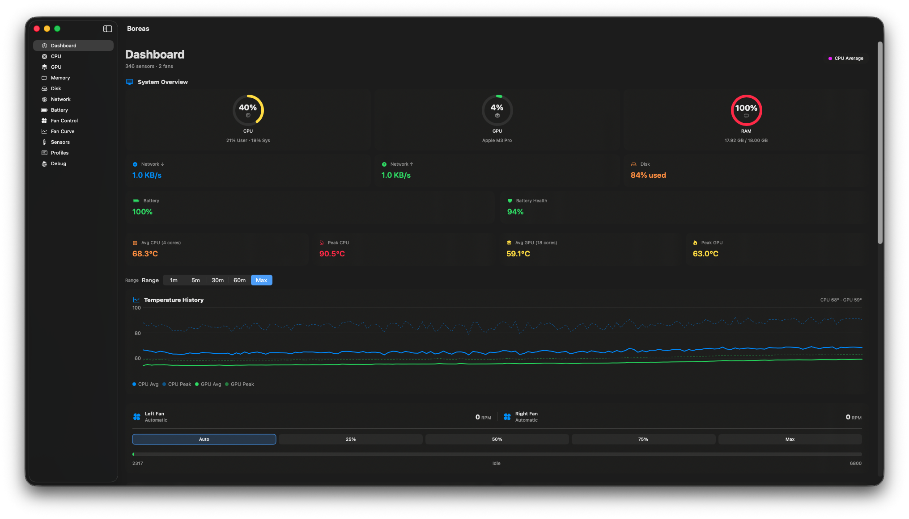
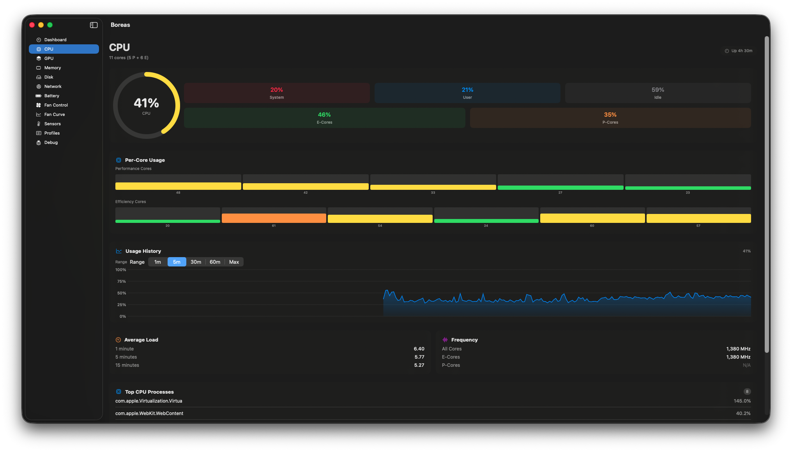
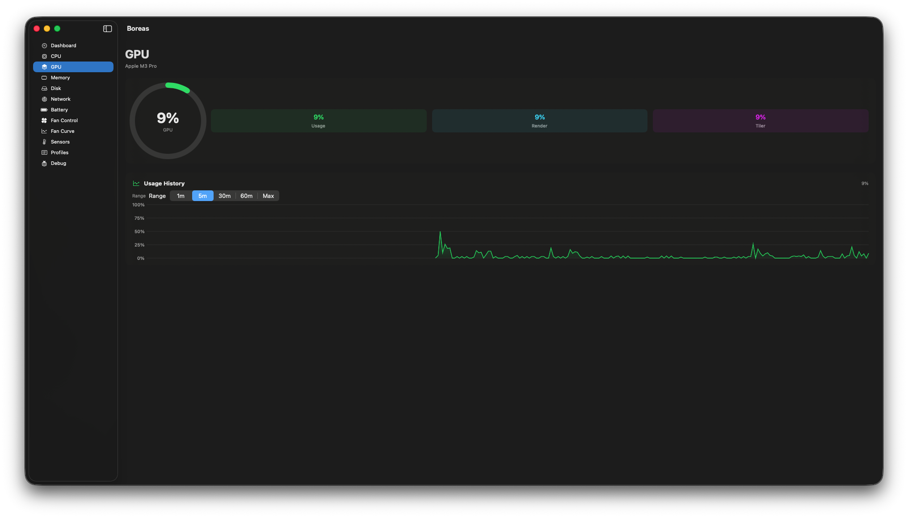
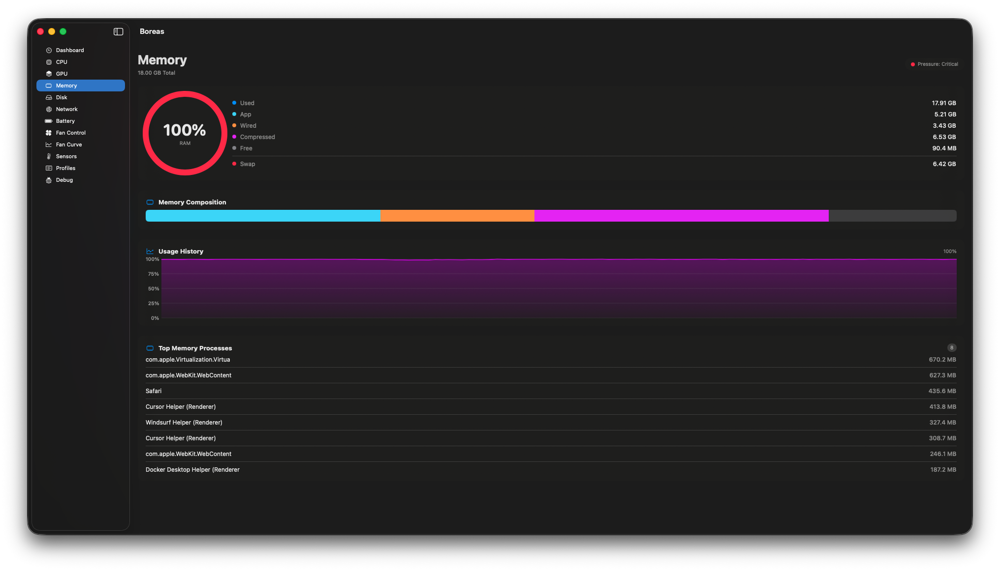
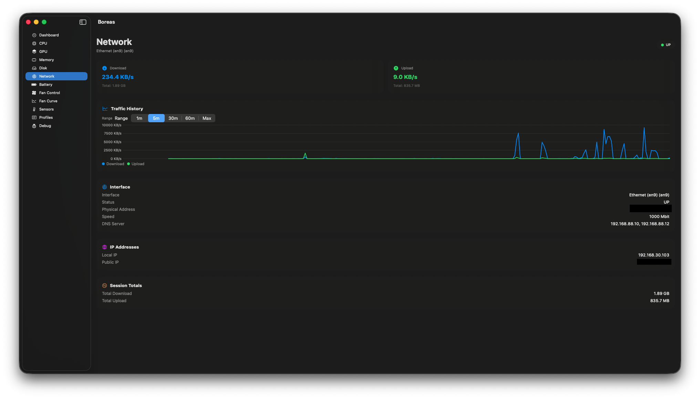
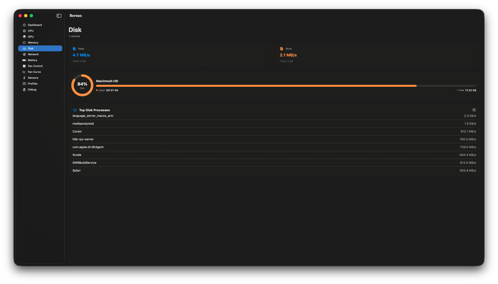
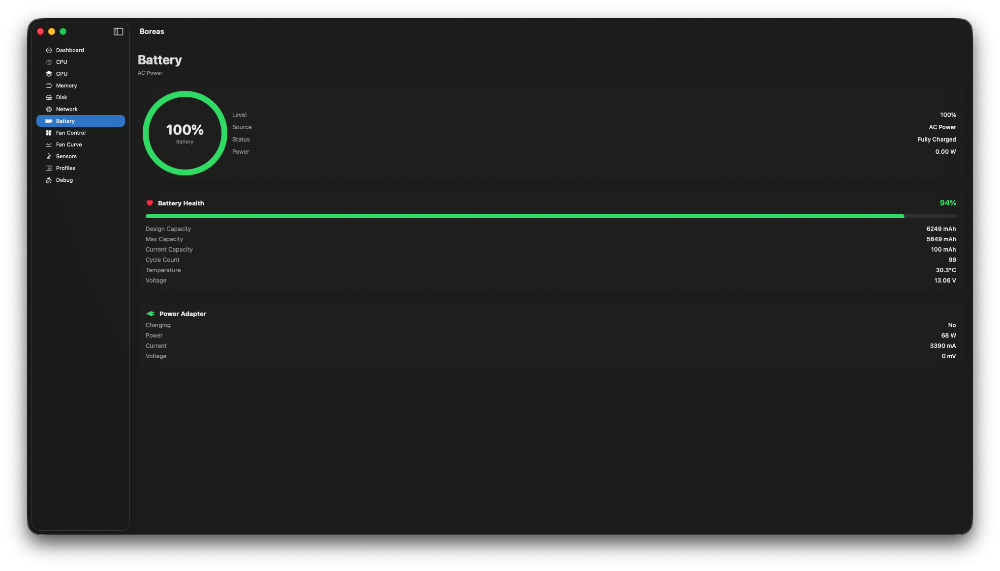

<div align="center">

# Heimdall
## High-Performance macOS System Monitor

</div>

A native macOS system monitoring utility built for extreme efficiency. Monitors CPU, GPU, RAM, Disk, Network, Battery, and all SMC sensors with fan control — all under **100MB RAM** and **5% CPU**.

## Architecture & Optimization

| Technique | Why |
|-----------|-----|
| `@Observable` macro | Per-property tracking eliminates cascade view redraws |
| `Canvas` (Core Graphics) | ~10x cheaper than Apple `Charts` for live graphs |
| `CAShapeLayer` / `CATextLayer` menu bar | GPU-composited, zero SwiftUI overhead |
| Ring buffers | Fixed-size, zero allocations after init |
| Visibility-aware polling | Slower rate when window/popover hidden |
| Sleep/wake pausing | Zero CPU when display is off |
| Solid backgrounds | No `.ultraThinMaterial` compositing overhead |
| Tiered polling | Fast (2s), Medium (10s), Slow (60s) tiers |

## Features

Explore each module below for a closer look at Heimdall's monitoring and control surfaces.

### Dashboard


### CPU Insights
Detailed P/E-core usage breakdown, per-core bars, usage history with selectable range, load averages, clock frequencies, and top CPU processes.


### GPU Insights
GPU utilization gauge, render/tiler split, usage history, and live stats for the current graphics device.


### Memory
Live memory pressure, breakdown of app/wired/compressed/swap usage, trend charts, and top memory-hungry processes.


### Network
Download/upload gauges, selectable traffic history, interface details, IP addresses, DNS servers, and public IP lookup.


### Disk
Volume usage gauges, I/O throughput, and top processes hitting the disk.


### Battery
Health, cycle count, adapter info, power draw, and charging status.


## Requirements

- macOS 15.0 (Sequoia) or later
- Xcode 16.0+ for building
- Admin privileges needed once to install root helper for SMC reads/writes

## Building

```bash
git clone https://github.com/amansuw/heimdall.git && cd heimdall
xcodebuild -project Heimdall.xcodeproj -scheme Heimdall -configuration Debug build
```

Or open `Heimdall.xcodeproj` in Xcode and press ⌘R.

## Project Structure

```
Heimdall/
├── HeimdallApp.swift              # App entry, AppDelegate, window + menu bar
├── main.swift                     # CLI modes (--smc-daemon, --reset-fans)
├── Core/
│   ├── SMCKit.swift               # Low-level SMC interface via IOKit
│   ├── SensorDefinitions.swift    # Sensor key lookup & validation
│   ├── RingBuffer.swift           # Fixed-size circular buffer
│   └── Formatters.swift           # Byte/speed/temp formatting
├── Readers/                       # Pure data collection (no UI state)
│   ├── CPUReader.swift            # host_processor_info, sysctl
│   ├── GPUReader.swift            # IOKit GPU stats
│   ├── RAMReader.swift            # host_statistics64
│   ├── DiskReader.swift           # statfs, IOKit disk I/O
│   ├── NetworkReader.swift        # getifaddrs, if_data
│   ├── BatteryReader.swift        # IOKit power source
│   ├── SensorReader.swift         # SMC sensor enumeration + reads
│   └── ProcessReader.swift        # proc_listpids, proc_pidinfo
├── State/                         # @Observable classes (per-property tracking)
│   ├── CPUState.swift, GPUState.swift, RAMState.swift
│   ├── DiskState.swift, NetworkState.swift, BatteryState.swift
│   ├── SensorState.swift, FanState.swift
├── Coordinator/
│   ├── MonitorCoordinator.swift   # Tiered polling, visibility-aware
│   └── FanController.swift        # Fan mode, curve eval, profiles
├── Daemon/
│   └── SMCDaemon.swift            # Root LaunchDaemon for SMC access
├── MenuBar/                       # Pure AppKit (no SwiftUI)
│   ├── StatusBarController.swift  # NSStatusItem management
│   └── MenuBarWidgetView.swift    # CALayer-based widget rendering
├── Views/                         # SwiftUI (only for layout)
│   ├── MainWindow/                # Dashboard, CPU, GPU, RAM, etc.
│   ├── Popover/                   # Menu bar popover
│   └── Shared/
│       └── CanvasChart.swift      # Reusable Canvas-based charts
└── Models/
    ├── SystemModels.swift         # Data structs (Sendable)
    ├── FanCurve.swift             # Curve with interpolation
    └── FanProfile.swift           # Profile presets + custom
```

## How It Works

- **SMCKit** communicates directly with Apple's SMC via `IOConnectCallStructMethod`
- **Fan writes require `Ftst` unlock on Apple Silicon**: writes `Ftst=1` to tell `thermalmonitord` to yield
- **All fan reads/writes go through a root LaunchDaemon** — no password after first install
- Fan curves use linear interpolation between user-defined control points
- Fans reset to macOS automatic control on app quit

## License

See [LICENSE](LICENSE) for details.