<div align="center">

# Heimdall
## High-Performance macOS System Monitor

</div>

A native macOS system monitoring utility built for extreme efficiency. Monitors CPU, GPU, RAM, Disk, Network, Battery, and all SMC sensors with fan control — all under **100MB RAM** and **5% CPU**.

## Requirements

- macOS 15.0 (Sequoia) or later — tested on Sequoia and macOS 26 (Tahoe)
- Apple Silicon Mac (Intel Macs running Sequoia are built for, but not tested)
- Admin password once, the first time you use fan control (see [Why does macOS warn about this app?](#why-does-macos-warn-about-this-app))
- Xcode 16.0+ only if you are building from source

## Install

> **Read this first:** Heimdall is a **menu bar app**. It has no Dock icon and it
> does not open a window when you launch it. When it is running you get a small
> **fan icon** in the menu bar at the very top of your screen. Click that icon to
> use it. If you launch Heimdall and "nothing happens", that is either normal
> (look at the menu bar) or it was blocked (see step 4 below).

Three ways to install, easiest first.

---

### A. Download the app (recommended)

**1. Download it.**

Go to the [Releases page](https://github.com/amansuw/heimdall/releases/latest) and
click the file ending in `.dmg` — it is named something like
`Heimdall-1.2.dmg`. Your browser saves it to your **Downloads** folder.

**2. Install it.**

Double-click the downloaded `Heimdall-1.2.dmg`. A window opens showing the
Heimdall icon and a shortcut to your **Applications** folder.

**Drag the Heimdall icon onto the Applications folder.** Wait for the copy to
finish, then close the window and eject the disk image (click the ⏏ button next
to "Heimdall" in the Finder sidebar).

**3. Open it for the first time — macOS will refuse. This is expected.**

Open **Finder**, click **Applications** in the sidebar, and double-click
**Heimdall**.

A warning appears. It says something close to:

> **"Heimdall" Not Opened**
>
> Apple could not verify "Heimdall" is free of malware that may harm your Mac or
> compromise your privacy.

Click **Done**.

> ⚠️ **Do not click "Move to Trash".** If you do, just download the DMG again and
> start over from step 1.

Heimdall is not malware — Apple simply has not checked it, because checking costs
$99/year and this project does not pay it. The next two steps tell macOS you
accept that. [The full explanation is below.](#why-does-macos-warn-about-this-app)

**4. Approve Heimdall once, in System Settings.**

Do this straight away, right after step 3. The approval button only appears for
about an hour after a blocked launch.

1. Click the **Apple menu** — the apple logo in the very top-left corner of your screen.
2. Choose **System Settings…**
3. In the list on the left, scroll down and click **Privacy & Security**.
   (There are a lot of entries; it is near the bottom, below "Screen Time".)
4. In the panel on the right, **scroll all the way down** to the section headed
   **Security**.
5. You will see a line saying **"Heimdall" was blocked to protect your Mac.**
   Click the **Open Anyway** button next to it.
6. macOS asks you to prove it is you: use **Touch ID**, or type your Mac's login
   password and click **OK**.
7. One last dialog asks *"Are you sure you want to open it?"* — click
   **Open Anyway**.

**5. Look at the menu bar.**

Heimdall is now running. Nothing opened, because it is a menu bar app. Look at
the top-right of your screen for a small **fan icon** and click it.

> Can't find the icon? A crowded menu bar (especially on a MacBook with a notch)
> hides icons that do not fit. Quit another menu bar app, or use a menu bar
> manager, and it will reappear.

**You never have to do steps 3 and 4 again.** Future launches, restarts and
logins open Heimdall normally.

**6. Fan control asks for your admin password — once.**

The first time you change a fan setting, macOS asks for your administrator
password. Heimdall uses it to install a small background helper that is allowed
to talk to your Mac's fan controller. It is asked for once, not every launch.
[What that helper is and how to remove it.](#the-background-helper)

---

### B. Homebrew

If you already use [Homebrew](https://brew.sh):

```sh
brew tap amansuw/heimdall https://github.com/amansuw/heimdall
brew install --cask --no-quarantine amansuw/heimdall/heimdall
```

`--no-quarantine` is required. Heimdall is not notarized by Apple, so a plain
`brew install --cask` would tag the app as quarantined and you would hit the same
Gatekeeper wall as in option A. `--no-quarantine` tells Homebrew not to apply
that tag to **this one install** — it changes nothing else on your system and
turns no protection off. In exchange you are trusting this tap instead of Apple,
so verify the download first if that matters to you: see
[Verifying a download](#verifying-a-download).

Upgrade and removal:

```sh
brew upgrade --cask heimdall
brew uninstall --zap --cask heimdall   # also removes the root helper
```

---

### C. Build from source

**Building locally sidesteps Gatekeeper entirely.** The quarantine flag is
attached by whatever *downloads* a file; an app you compile on your own Mac never
gets one, so it just opens.

```sh
git clone https://github.com/amansuw/heimdall.git
cd heimdall
xcodebuild -project Heimdall.xcodeproj -scheme Heimdall -configuration Release -derivedDataPath build build
cp -R build/Build/Products/Release/Heimdall.app /Applications/
open /Applications/Heimdall.app
```

Or open `Heimdall.xcodeproj` in Xcode and press ⌘R.

To run the unit tests, press ⌘U in Xcode or:

```sh
xcodebuild -project Heimdall.xcodeproj -scheme Heimdall test
```

They cover SMC value decoding (including a replay of raw bytes from a real
diagnostics report), fan curves and history windowing. The test bundle does not
launch the app or touch the SMC, so it is safe to run anywhere.

No Apple Developer account is needed to build — the project signs ad-hoc
(`CODE_SIGN_IDENTITY = "-"`, empty team), which is exactly what CI does.

---

## Updates

**Downloaded the DMG?** Release builds check for updates themselves and ask
before installing one. You can also choose **Heimdall → Check for Updates…** or
use the button in **Settings → General**. Every update is verified against a
signing key built into the app before it is installed, and because Heimdall
installs it itself, you do not repeat the Privacy & Security approval.

The first time you use fan control after an update, Heimdall asks for your
password once more to install the matching background helper.

**Homebrew:** `brew upgrade --cask --greedy heimdall`.

**Built from source:** pull and rebuild. Source builds carry no update key, so
the updater stays off.

Maintainers: see [docs/RELEASING.md](docs/RELEASING.md).

---

## Why does macOS warn about this app?

**Short version:** Heimdall has no paid Apple Developer account, so Apple has
never inspected it, so macOS refuses to open it until you say otherwise. The
warning is about *missing paperwork*, not about something macOS found.

**Longer version.** To ship a Mac app that opens without complaint you need a
Developer ID certificate and Apple's notarization service, which together
require an Apple Developer Program membership at $99/year. This project does not
have one and does not want one.

What Heimdall does instead is **ad-hoc signing**. The app carries a signature
that proves it has not been tampered with since it was built, but that signature
is not tied to an identity Apple has vetted. `spctl` will reject it. That is not
a bug in the packaging and there is no clever DMG layout, helper script or
installer trick that avoids it: macOS propagates the quarantine flag to anything
copied out of a downloaded disk image, so the one-time approval in step 4 is
genuinely unavoidable for a downloaded build.

**What this README will never tell you to do:** disable Gatekeeper. Commands like
`sudo spctl --master-disable` switch off the check for *every* app on your Mac,
forever. Do not run that for Heimdall or for anything else. The "Open Anyway"
approval above applies to this one app and leaves the rest of your system exactly
as it was.

If you would rather not extend that trust, [build from source](#c-build-from-source).
The source is entirely in this repository.

### The background helper

Heimdall can read many sensors as a normal app, but **writing** fan control keys
to the System Management Controller requires root. So the first time you use fan
control, Heimdall asks for your administrator password and installs a
LaunchDaemon:

| What | Where |
|---|---|
| Label | `com.heimdall.smchelper` |
| Configuration | `/Library/LaunchDaemons/com.heimdall.smchelper.plist` |
| What runs | a root-owned copy of the app, `/Library/PrivilegedHelperTools/com.heimdall.smchelper.app`, started with `--smc-daemon` |
| Talks to the app over | a local socket file under `/var/run/heimdall` |
| Log | `/var/log/heimdall-daemon.log` |
| Network access | none |

It exists to do one job: read and write fan-related SMC keys when the app asks.

It runs from its own copy because launchd starts it as root. The app in
`/Applications` can be replaced by any program running as you; the copy in
`/Library/PrivilegedHelperTools` can only be changed by root. The helper accepts
connections only from an app whose code signature matches its own, so a
modified or substituted app is refused — and after you update Heimdall, it asks
for your password once more to install the helper that matches the new version.

**It is not removed when you drag the app to the Trash.** The daemon keeps
running. Use one of the uninstall methods below.

### Verifying a download

Every release is built by GitHub Actions from a public commit, using
[`.github/workflows/release.yml`](.github/workflows/release.yml) in this
repository. Two things let you check that the file you downloaded is that file.

**1. Checksum.** Each release includes a `SHA256SUMS.txt` asset. Compare it:

```sh
shasum -a 256 ~/Downloads/Heimdall-1.2.dmg
```

The output must match the line in `SHA256SUMS.txt` exactly.

**2. Build provenance.** This is the free stand-in for notarization. GitHub signs
a statement binding the DMG's digest to this repository, this workflow and the
exact commit it was built from. With the [GitHub CLI](https://cli.github.com)
installed:

```sh
gh attestation verify ~/Downloads/Heimdall-1.2.dmg --repo amansuw/heimdall
```

A successful result means the DMG really was produced by this repository's CI and
was not built or modified by anyone on a laptop somewhere. It does **not** mean
Apple has reviewed the app — nothing here can give you that.

## Uninstall

Dragging the app to the Trash leaves the root helper installed and running. Do
one of these instead.

**If you installed with Homebrew:**

```sh
brew uninstall --zap --cask heimdall
```

**Otherwise**, run the uninstaller from a checkout of this repository:

```sh
./scripts/uninstall.sh
```

It prints exactly what it will delete and waits for you to confirm. Add
`--dry-run` to see the plan without changing anything, or `--keep-settings` to
keep your fan profiles and curves.

It quits the app, returns your fans to macOS automatic control, unloads
`com.heimdall.smchelper`, and removes the daemon's plist, the helper copy in
`/Library/PrivilegedHelperTools`, `/var/run/heimdall`,
`/var/log/heimdall-daemon.log`, `/Applications/Heimdall.app` and your Heimdall
preferences. Anything already gone is skipped, so it is safe to run twice or
after a partial manual cleanup.

## Architecture & Optimization

| Technique | Why |
|-----------|-----|
| `@Observable` macro | Per-property tracking eliminates cascade view redraws |
| `Canvas` (Core Graphics) | ~10x cheaper than Apple `Charts` for live graphs |
| Pre-rendered `NSImage` menu bar icon | Plain AppKit `NSStatusBarButton`, no SwiftUI; the icon is only redrawn when the temperature color band actually changes |
| Ring buffers | Fixed-size, zero allocations after init |
| Visibility-aware polling | Slower rate when window/popover hidden |
| Sleep/wake pausing | Zero CPU when display is off |
| Opaque surfaces by default | `.ultraThinMaterial` is confined to three small transient overlays (hover tooltips and chart legends); panels, cards and backgrounds stay solid |
| Tiered polling | Fast (2s), Medium (10s), Slow (60s) tiers |

## Features

Explore each module below for a closer look at Heimdall's monitoring and control surfaces.

### Dashboard
System overview with CPU/GPU temperature cards, CPU/GPU/Neural Engine power, selectable temperature history, fan status, and quick fan presets.
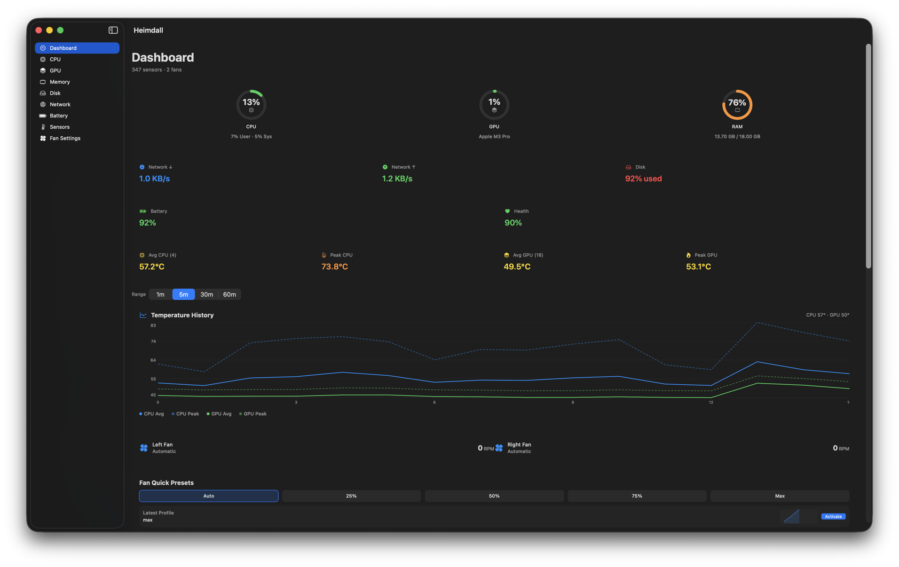

### CPU
P/E-core usage gauges, per-core bars, usage history with selectable time range (default 5 minutes), load averages, clock frequencies, and top CPU processes ranked over the selected window with one-click quit.
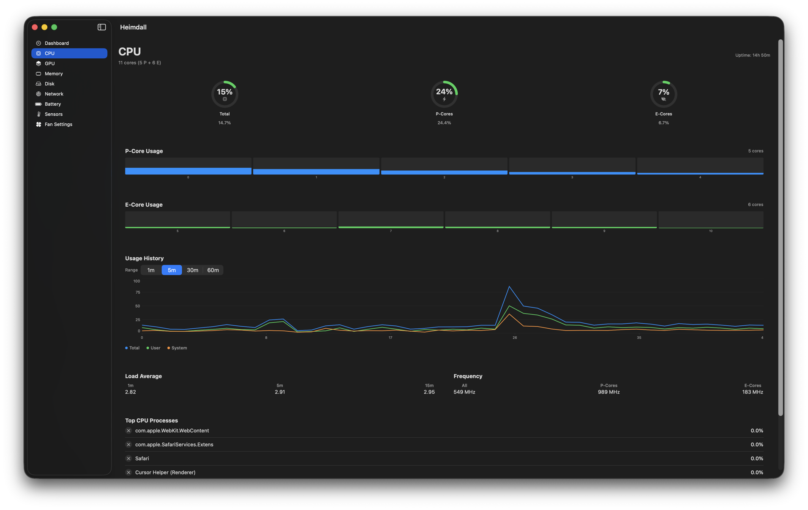

### GPU
GPU utilization gauge, render/tiler split, usage history, CPU/GPU/Neural Engine power history, device stats, and top GPU processes over the selected time range.
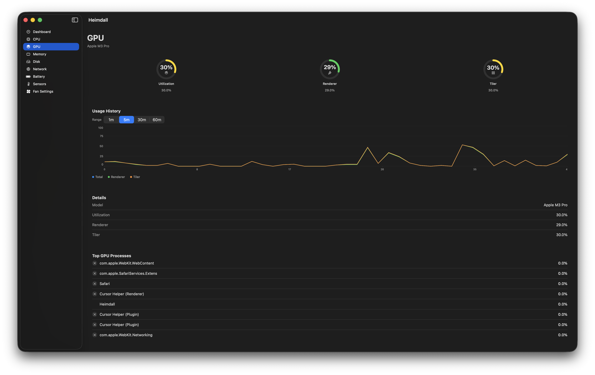

### Memory
Live memory pressure, app/wired/compressed/swap breakdown, trend charts, and top memory processes over the selected time range.
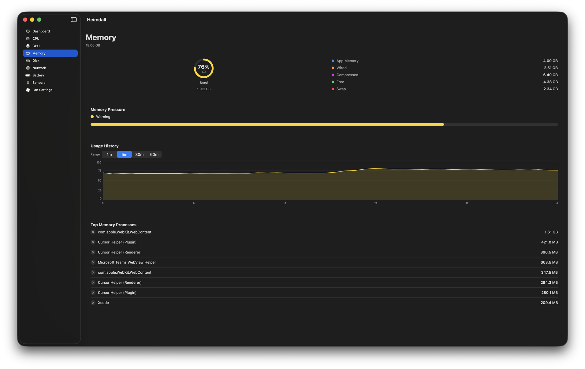

### Network
Download/upload gauges, selectable traffic history, interface details, IP addresses, DNS servers, public IP lookup, and top bandwidth processes over the selected window.
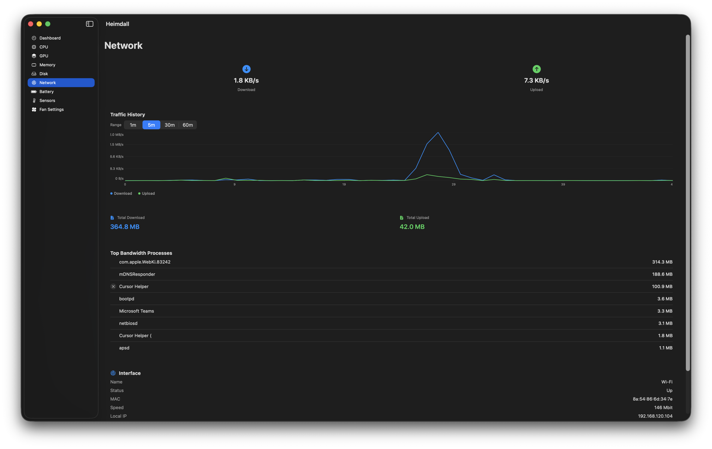

### Disk
Volume usage gauges, I/O throughput history, and top disk processes over the selected time range.
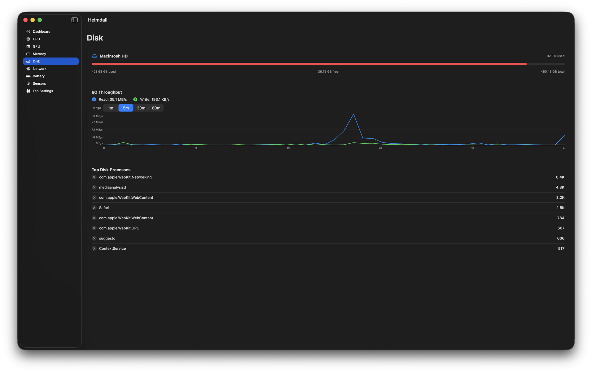

### Battery
Charge level, health percentage aligned with Apple Settings, cycle count, capacity in mAh, adapter info, power draw, and charging status.
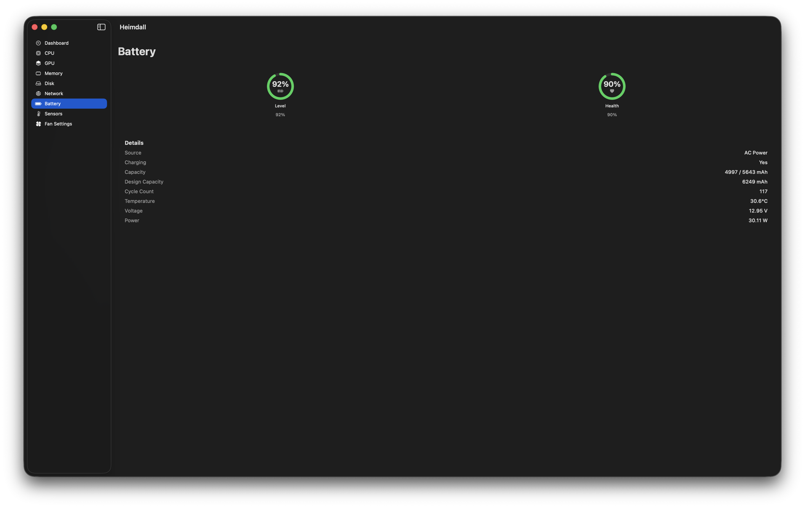

### Sensors
Full SMC sensor grid with search, category filters, and live readings for temperature, voltage, current, and power.
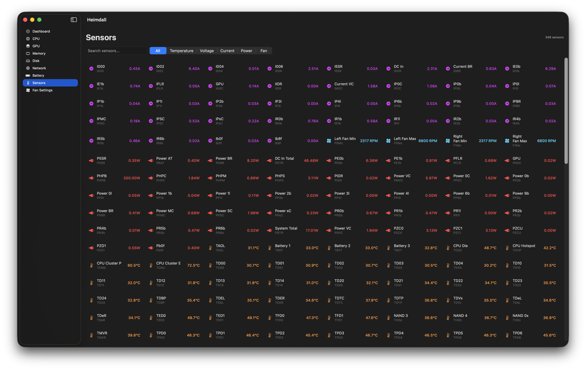

### Fan Settings
Fan profiles (Default, Silent, Performance, and custom), control mode picker, per-fan RPM cards, and manual speed control.
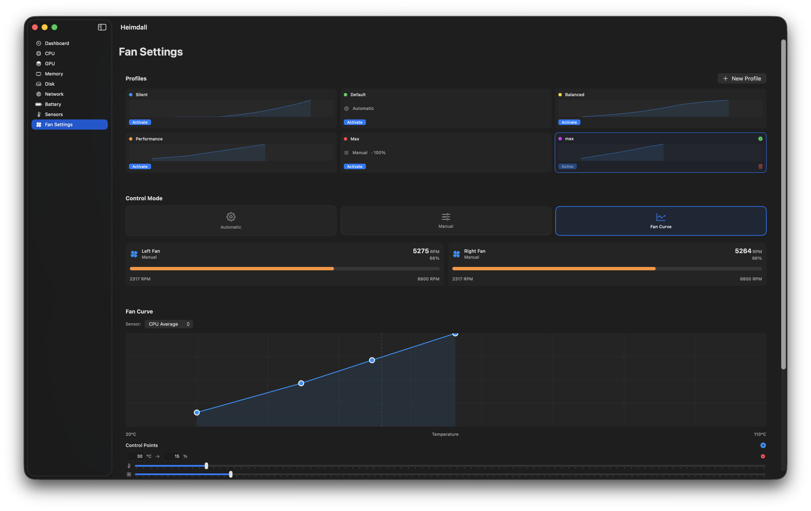

### Fan Curve
Interactive temperature-to-fan-speed curve editor with draggable control points for custom cooling profiles.
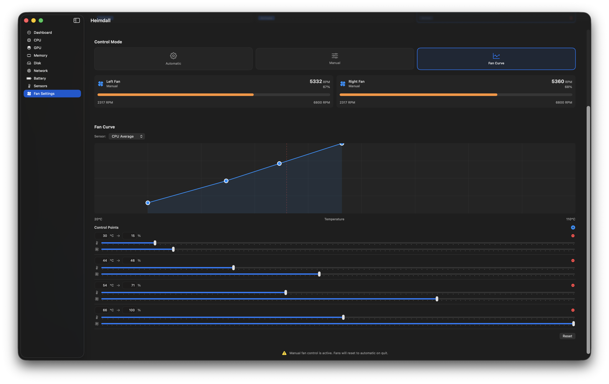

### Menu Bar Popover
Compact temperature stats, live chart, system gauges, fan RPMs, and quick profile switching (Default, Silent, Performance, plus your latest custom profile).

<div align="center">

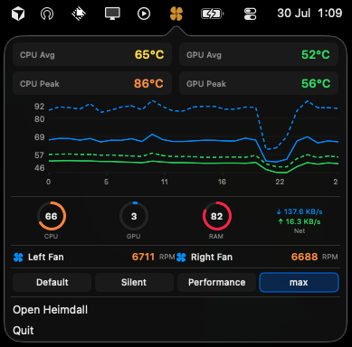

</div>

## Project Structure

```
Heimdall/
├── HeimdallApp.swift              # App entry, AppDelegate, window + menu bar
├── main.swift                     # CLI modes (--smc-daemon, --reset-fans)
├── Core/
│   ├── SMCKit.swift               # Low-level SMC interface via IOKit
│   ├── SensorDefinitions.swift    # Sensor key lookup & validation
│   ├── RingBuffer.swift           # Fixed-size circular buffer
│   └── Formatters.swift           # Byte/speed/temp formatting
├── Readers/                       # Pure data collection (no UI state)
│   ├── CPUReader.swift            # host_processor_info, sysctl
│   ├── GPUReader.swift            # IOKit GPU stats
│   ├── RAMReader.swift            # host_statistics64
│   ├── DiskReader.swift           # statfs, IOKit disk I/O
│   ├── NetworkReader.swift        # getifaddrs, if_data
│   ├── BatteryReader.swift        # IOKit power source
│   ├── SensorReader.swift         # SMC sensor enumeration + reads
│   └── ProcessReader.swift        # proc_listpids, proc_pidinfo
├── State/                         # @Observable classes (per-property tracking)
│   ├── CPUState.swift, GPUState.swift, RAMState.swift
│   ├── DiskState.swift, NetworkState.swift, BatteryState.swift
│   ├── SensorState.swift, FanState.swift
│   └── ProcessHistory.swift       # Time-windowed process metrics
├── Coordinator/
│   ├── MonitorCoordinator.swift   # Tiered polling, visibility-aware
│   └── FanController.swift        # Fan mode, curve eval, profiles
├── Daemon/
│   └── SMCDaemon.swift            # Root LaunchDaemon for SMC access
├── MenuBar/                       # Pure AppKit (no SwiftUI)
│   ├── StatusBarController.swift  # NSStatusItem management
│   └── MenuBarWidgetView.swift    # Tinted NSImage status-item icon
├── Views/                         # SwiftUI (only for layout)
│   ├── MainWindow/                # Dashboard, CPU, GPU, RAM, etc.
│   ├── Popover/                   # Menu bar popover
│   └── Shared/
│       └── CanvasChart.swift      # Reusable Canvas-based charts
└── Models/
    ├── SystemModels.swift         # Data structs (Sendable)
    ├── FanCurve.swift             # Curve with interpolation
    └── FanProfile.swift           # Profile presets + custom
```

## How It Works

- **SMCKit** communicates directly with Apple's SMC via `IOConnectCallStructMethod`
- **Fan writes require `Ftst` unlock on Apple Silicon**: writes `Ftst=1` to tell `thermalmonitord` to yield
- **All fan reads/writes go through a root LaunchDaemon** — no password after first install
- Fan curves use linear interpolation between user-defined control points
- Fans reset to macOS automatic control on app quit

## License

See [LICENSE](LICENSE) for details.